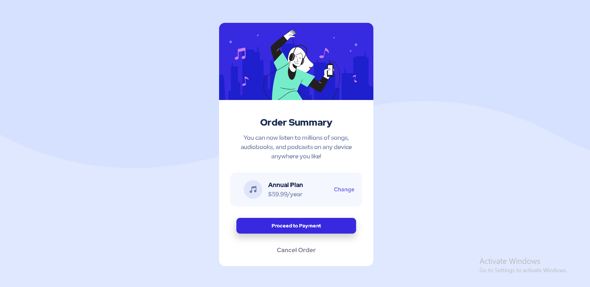

# order-summary-component
# Frontend Mentor - Order summary card solution

This is a solution to the [Order summary card challenge on Frontend Mentor](https://www.frontendmentor.io/challenges/order-summary-component-QlPmajDUj). Frontend Mentor challenges help you improve your coding skills by building realistic projects. 

## Table of contents

- [Overview](#overview)
  - [The challenge](#the-challenge)
  - [Screenshot](#screenshot)
  - [Links](#links)
- [My process](#my-process)
  - [Built with](#built-with)
  - [Useful resources](#useful-resources)
- [Author](#author)

## Overview

### The challenge

Users should be able to:

- See hover states for interactive elements

### Screenshot

### Links

- Solution URL:(https://www.frontendmentor.io/solutions/ordersummarycomponent-2BaB2rdef-)
- Live Site URL:(https://sniper23403.github.io/order-summary-component/)

## My process

### Built with
- Semantic HTML5 markup
- CSS custom properties
- Flexbox
- CSS Grid
- Mobile-first workflow

### Useful resources

- [w3schools](https://www.example.com) - This helped me for Media Queries property. I really liked this pattern and will use it going forward.
anyone still learning this concept.

## Author
- Frontend Mentor - [@sniper23403](https://www.frontendmentor.io/profile/sniper23403)
- Twitter - [@TheNewMagic1](https://twitter.com/TheNewMagic1)

